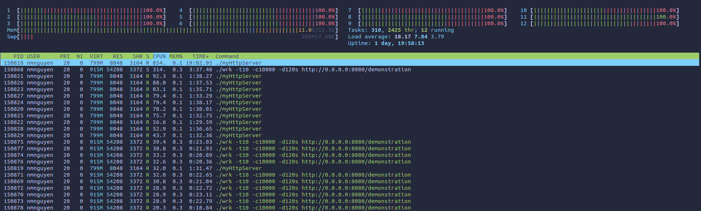

# HTTP/1.1 SERVER

Implementation of a simple HTTP/1.1 server in C++

## Features and drawbacks

- Only support HTTP GET Method
- Provide an extensible code to add other HTTP Methods
- HTTP 1.1 server supports persistent connection
- TCP Transport Layer for this server only support IPv4, but extend to IPv6 easily
- Able to scale upto 10000 connections
- Able to handle 100000 request per second, refer to [Benchmark](##Benchmarking)
- Connection close by request header is not implemented
- URI instance only support path as a std::string

## Build the server

```bash
mkdir build && cd build
cmake ..
make
./myHttpServer      # Start the HTTP server
```

- 2 htmls `/` and `/demonstration` are created for demonstration purposes. Type the uri `0.0.0.0:8080` for directory `/` and `0.0.0.0:8080/demonstration` for directory `/demonstration` on your Google Chrome or Firefox.


## Overall design

The server program consists of:

- 1 main thread for user interaction.
- 1 listener thread to accept incoming clients.
- 10 backend threads to wait for incoming request and reply with responses. Each thread can handle upto 10000 events.
- Naive http parsing strategy. For more complex strategy, refer to https://github.com/nodejs/http-parser
- CMakeLists.txt to help compile the program


## Checking your hardware information
```bash
$ lscpu
Architecture:                    x86_64
CPU op-mode(s):                  32-bit, 64-bit
Byte Order:                      Little Endian
Address sizes:                   39 bits physical, 48 bits virtual
CPU(s):                          12
On-line CPU(s) list:             0-11
Thread(s) per core:              2
Core(s) per socket:              6
Socket(s):                       1
NUMA node(s):                    1
Vendor ID:                       GenuineIntel
CPU family:                      6
Model:                           165
Model name:                      Intel(R) Core(TM) i7-10750H CPU @ 2.60GHz
Stepping:                        2
CPU MHz:                         900.065
CPU max MHz:                     5000.0000
CPU min MHz:                     800.0000
BogoMIPS:                        5199.98
Virtualization:                  VT-x
L1d cache:                       192 KiB
L1i cache:                       192 KiB
L2 cache:                        1.5 MiB
L3 cache:                        12 MiB
NUMA node0 CPU(s):               0-11
```


## Benchmarking
Benchmarking tool [wrk](https://github.com/wg/wrk)

Here are the results for two test runs. Each test ran for 2 minute, with 10 client threads. The first test had only 1000 concurrent connections, while the second test had 10000.

The requests/sec for the first and second test is 334648 and 336119, respectively.

```bash
$ ./wrk -t10 -c1000 -d120s http://0.0.0.0:8080/demonstration
Running 2m test @ http://0.0.0.0:8080/demonstration
  10 threads and 1000 connections
  Thread Stats   Avg      Stdev     Max   +/- Stdev
    Latency     3.95ms    4.83ms  80.21ms   87.18%
    Req/Sec    33.70k     7.57k   75.80k    70.71%
  40189049 requests in 2.00m, 6.62GB read
Requests/sec: 334648.30
Transfer/sec:     56.49MB
```

```bash
$ ./wrk -t10 -c10000 -d120s http://0.0.0.0:8080/demonstration
Running 2m test @ http://0.0.0.0:8080/demonstration
  10 threads and 10000 connections
  Thread Stats   Avg      Stdev     Max   +/- Stdev
    Latency     2.65ms    4.11ms  78.75ms   91.09%
    Req/Sec    33.85k     8.30k  100.12k    70.43%
  40366621 requests in 2.00m, 6.65GB read
  Socket errors: connect 8989, read 0, write 0, timeout 0
Requests/sec: 336118.65
Transfer/sec:     56.74MB
```

## CPU usage at 10000 connections



